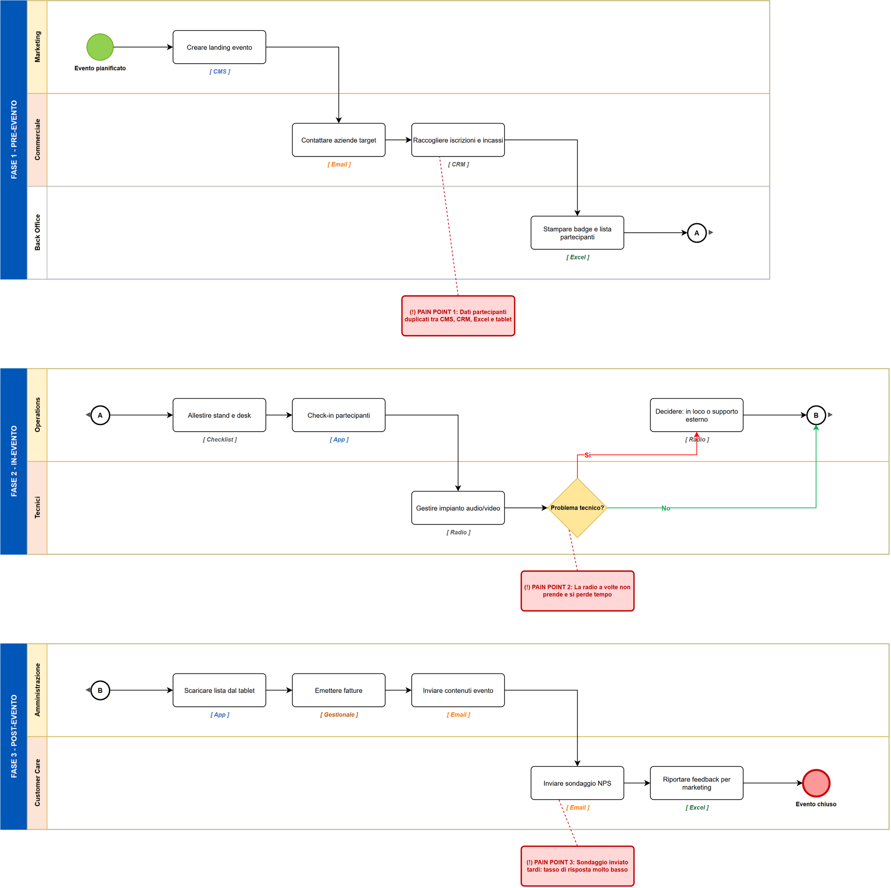
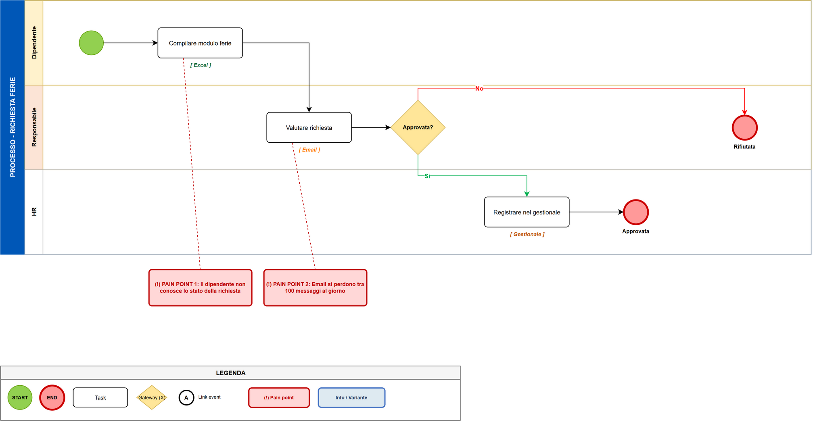

# Process Builder — AI Skill for Business Process Diagrams

[](LICENSE)
[](scripts/generate_swimlane.py)
[](scripts/generate_swimlane.py)
[](../../pulls)

An open-source [Claude Skill](https://docs.claude.com/en/docs/agents-and-tools/agent-skills) that turns a **conversation about a business process** into a professional **swimlane diagram** in [draw.io / diagrams.net](https://www.diagrams.net/) format — hybrid **BPMN 2.0** notation, curated palette, pain points mapped where they hurt.



*The diagram above was generated from a single JSON file — no manual drawing, no XML editing.*

## What it does

- **AS-IS mode** — the agent interviews the user about how a process works today (who does what, when, with which tool, where it hurts) and produces a diagram with actors as lanes, BPMN gateways for decisions, tool annotations, and **pain points** highlighted outside the flow.
- **TO-BE mode** — starting from an AS-IS, it proposes an optimized process in two variants: **Quick Win** (2–4 weeks, light automation) and **Full Automation** (deep integrations), with automated/new tasks visually marked.
- **Interview-first, always** — the skill enforces a hard rule: no diagram until the agent knows who does what, in which order, with which tool, and which decisions exist and what they depend on. No plausible-but-invented processes.

> **Note:** the skill content (prompts, interview guides) is in **Italian**, as it was designed for process-mapping interviews with Italian-speaking teams. The generator script and its JSON schema are language-agnostic.

## From a tiny JSON…

```json
{
  "phases": [{
    "name": "PROCESSO - RICHIESTA FERIE",
    "actors": ["Dipendente", "Responsabile", "HR"],
    "elements": [
      {"id": "s1", "type": "start",       "actor": "Dipendente"},
      {"id": "a1", "type": "action",      "actor": "Dipendente",   "label": "Compilare modulo ferie", "tool": "Excel"},
      {"id": "g1", "type": "gateway_xor", "actor": "Responsabile", "label": "Approvata?"},
      {"id": "pp1","type": "pain_point",  "target": "a1", "label": "Il dipendente non conosce lo stato della richiesta"}
    ],
    "connections": [
      {"from": "s1", "to": "a1"},
      {"from": "a1", "to": "g1"}
    ]
  }]
}
```

## …to a boardroom-ready diagram



## How it works

The agent never writes draw.io XML by hand. It produces a small JSON description of the process and runs:

```bash
python scripts/generate_swimlane.py process.json process.drawio
```

The script validates first — actionable errors for duplicate ids, orphan connections, unknown actors — then handles the whole layout: columns, lanes, phases, multi-row pain points, and **collision-free arrow routing** (gateway exits are automatically assigned to distinct sides of the diamond, long same-lane jumps hop over intermediate elements).

```bash
python scripts/generate_swimlane.py process.json --validate            # check only
python scripts/generate_swimlane.py process.json out.drawio --strict   # warnings block too
```

Requirements: **Python ≥ 3.9**, zero third-party dependencies.

## Try it in 30 seconds

```bash
python scripts/generate_swimlane.py examples/richiesta_ferie_as_is.json ferie.drawio
```

Open `ferie.drawio` in [app.diagrams.net](https://app.diagrams.net/) or in draw.io Desktop.

## Using it as a Claude Skill

Copy this repository into a `process-builder` folder inside your Claude skills directory (or grab `process-builder.skill` from the [latest release](../../releases/latest)), then ask something like:

> "Let's map our order-management process: draw the AS-IS."

The agent will interview you, confirm the reconstruction, and hand you the `.drawio` file.

## Repository layout

| Path | Purpose |
|------|---------|
| `SKILL.md` | The skill entry point: workflows, hard rules, quality checklist |
| `references/interview-guide.md` | How to run the AS-IS / TO-BE interview, and when a process deserves multiple phases |
| `references/style-guide.md` | Visual style: shapes, palette, BPMN conventions |
| `references/drawio-xml-guide.md` | JSON input schema for the generator script |
| `scripts/generate_swimlane.py` | JSON → .drawio generator (validation + layout) |
| `examples/` | Ready-to-run example JSONs (single phase, 3 phases with link events, TO-BE with info panels) |
| `evals/` | Evaluation scenarios used to test the skill |

## License

[MIT](LICENSE) — use it, fork it, ship it.

---

Maintained by [**Castaldo Solutions**](https://github.com/Castaldo-Solutions) — enterprise-grade technology, built for SMEs.
